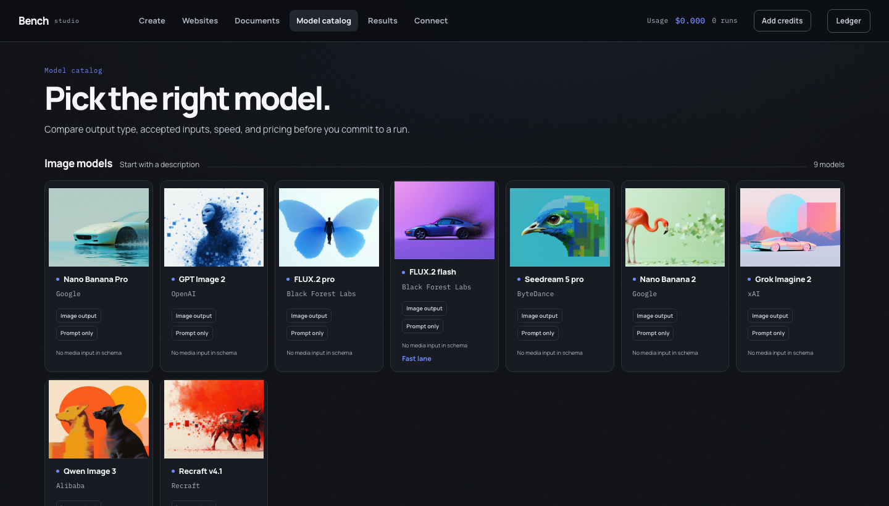
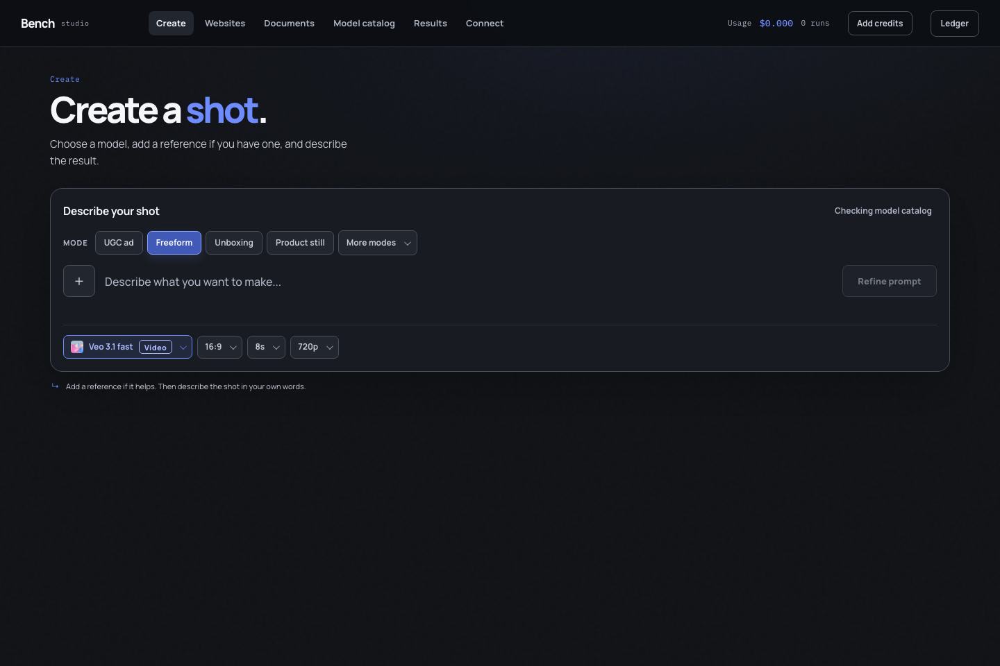
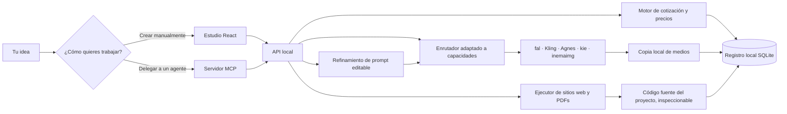
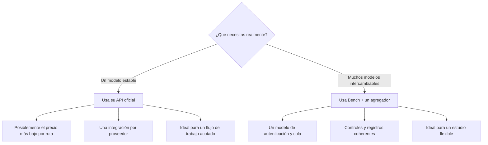
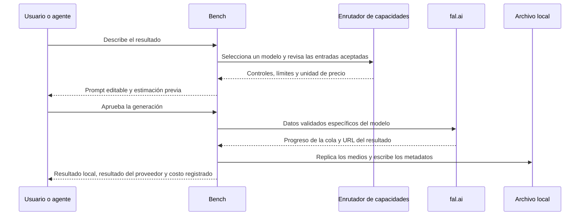
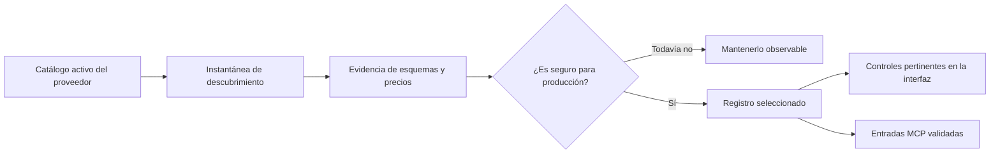
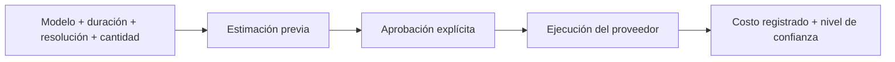
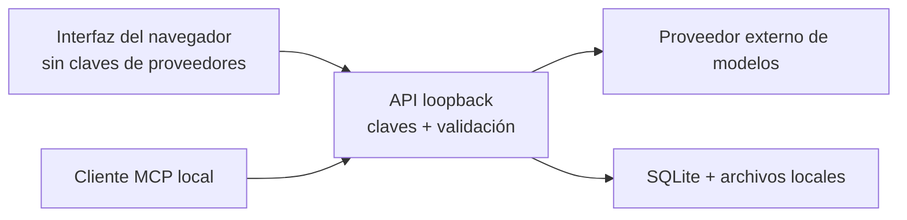

<div align="center">

# Bench Studio

**🇧🇷 [Português](README.md) · 🇺🇸 [English](README.en.md) · 🇪🇸 [Español](README.es.md)**

### Deja de alquilar el envoltorio. Sé dueño de la capa creativa.

Un estudio creativo local primero para imágenes, videos, sitios web, PDFs diseñados y flujos de trabajo con agentes de IA.

[](LICENSE)


**[Inicio rápido](#run-it-in-three-minutes)** · **[Consejos](#tips-that-save-you-time-and-money)** · **[Cómo funciona en detalle](docs/COMO-FUNCIONA.md)** · **[Qué cambió y por qué](docs/HISTORICO.md)** · **[Seguridad](#security-and-privacy)**

</div>



Bench Studio reúne **73 rutas seleccionadas de imágenes y videos en 5 proveedores**, refinamiento de prompts,
controles adaptados a las capacidades, custodia local de archivos y un registro transparente de costos
en una sola interfaz. El mismo sistema está disponible para Claude, Codex, Cursor
y otros clientes compatibles mediante MCP.

Tus claves permanecen en el servidor de tu máquina. Puedes editar tus prompts antes de
gastar. Tus resultados se replican localmente. Tus costos se registran en unidades reales,
en lugar de desaparecer en créditos misteriosos.

> [!NOTE]
> Esta es la distribución pública sanitizada. No incluye historial de generaciones,
> cargas, bases de datos privadas, rutas personales, credenciales ni artefactos de
> compilación locales. Tu archivo comienza vacío.

## 📖 Guía de uso

Guía completa (página de presentación + paso a paso): **https://inematds.github.io/bench-studio-en/guia/es/**

## Por qué existe

La mayoría de los productos de IA creativa combinan cinco elementos útiles —acceso a modelos,
mejora de prompts, enrutamiento, almacenamiento y facturación— y luego ocultan las conexiones
entre ellos detrás de un plan mensual. Bench mantiene la comodidad y hace que cada conexión
se pueda inspeccionar.

| En lugar de… | Bench te ofrece… |
| --- | --- |
| La hoja de ruta de modelos de un proveedor | Un registro seleccionado que puedes ampliar o reemplazar |
| Un cuadro de carga genérico | Controles derivados de las entradas aceptadas por cada endpoint |
| Una reescritura de prompt invisible | Un borrador editable y específico para cada modelo antes del envío |
| Créditos abstractos | Una estimación previa y metadatos del gasto registrado |
| Resultados atrapados en la galería de una cuenta | Archivos replicados localmente y metadatos persistentes |
| Un flujo de trabajo solo desde la interfaz | Las mismas capacidades desde la interfaz y MCP |
| Esperar a la próxima función | Código fuente que puedes inspeccionar, cambiar y ampliar |

Bench **no** es dueño de los modelos subyacentes. Te da control sobre la capa portátil
que conecta tus ideas, herramientas, proveedores, archivos y costos.

## Ejecútalo en tres minutos

### Lo que necesitas

**Obligatorio**

- Node.js **22.5+**; se recomienda Node 24, porque Bench usa `node:sqlite`.
- npm.

**Eso es todo lo que necesitas.** Todos los proveedores son opcionales y funcionan de forma
independiente: si falta una clave, esos modelos aparecen como no disponibles, junto con el motivo
y cómo solucionarlo; el estudio sigue iniciándose. Para generar cualquier cosa, configura al
menos uno de estos:

| Proveedor | Modelos | Costo | Lo que necesitas |
|---|---|---|---|
| [fal.ai](https://fal.ai/dashboard/keys) | 37 | dólares, precios vigentes | `FAL_KEY` |
| [Kling](https://klingai.com) | 26 | créditos del plan | `npm i -g @klingai/cli-global && kling login` |
| [Agnes AI](https://apihub.agnes-ai.com) | 4 | cero | `AGNES_API_KEY` |
| [kie.ai](https://kie.ai/api-key) | 4 | créditos | `KIE_API_KEY` |
| [inemaimg](https://github.com/inematds/inemaimg) | 2 | cero (tu GPU) | un servidor local en ejecución |

**Opcional, pero recomendable**

- Una clave de [Google AI Studio](https://aistudio.google.com/apikey) o
  [OpenRouter](https://openrouter.ai/keys) para refinar prompts. Sin ningún refinador,
  el prompt se envía tal cual — Agnes lo rechaza porque requiere inglés.
- Google Chrome, para imprimir PDFs y hacer una revisión visual previa.
- Una sesión iniciada en Codex o Claude Code, para crear sitios web y documentos con agentes.

### 1. Clona e instala

```bash
git clone https://github.com/inematds/bench-studio-en.git
cd bench-studio-en
npm install
```

### 2. Agrega las credenciales del servidor

```bash
cp .env.example .env
```

Completa lo que tengas. `.env.example` documenta las 19 variables: qué habilita cada una,
cómo se factura y dónde crear la clave. Las claves permanecen en el servidor y nunca se envían
al navegador; `.env` está excluido de Git y se crea con permisos exclusivos para el propietario.

Orden de lectura, de mayor a menor prioridad:

```
exportada en tu shell  >  .env en el proyecto  >  ~/.env
```

**O sáltate el archivo por completo:** inicia el estudio y usa el botón **Config** de la
esquina superior derecha. Muestra cada ajuste —presente o ausente, el origen del valor y sus
últimos 4 caracteres—, te permite probar cada proveedor y escribe `.env` por ti. Por seguridad,
solo acepta escrituras desde la máquina que ejecuta el estudio.

### 3. Inicia el estudio

```bash
npm run dev
```

Abre **[http://localhost:5200](http://localhost:5200)**.

| Servicio | Dirección |
| --- | --- |
| Estudio | `http://localhost:5200` |
| API local | `http://localhost:8787` |
| Resumen de estado y capacidades | `http://localhost:8787/api/health` |

Si alguno de los puertos está ocupado:

```bash
PORT=8790 BENCH_API_PORT=8790 BENCH_WEB_PORT=5201 npm run dev
```

## Accede desde otra máquina

Ambos puertos están vinculados a loopback, así que una instalación nueva solo te responde a ti.
Abrir el acceso implica tres cosas: que la interfaz escuche en todas las interfaces, una regla de
firewall y recordar deshacer ambas. Un comando hace las tres:

```bash
./scripts/remote.sh open      # publica la interfaz en la IP de esta máquina
./scripts/remote.sh status    # indica si está abierto o cerrado, y con qué protección
./scripts/remote.sh close     # vuelve a permitir solo el acceso local
```

`open` muestra la dirección que puedes compartir y luego te indica que reinicies con
`npm run dev`. `close` revierte exactamente lo que hizo `open`: lee un archivo de estado
escrito al abrir, en lugar de hacer suposiciones, y deja intacta la regla de SSH, porque
eliminarla es una forma de bloquearse el acceso a tu propio servidor.

Dos opciones que conviene conocer:

```bash
./scripts/remote.sh open --ip 203.0.113.7   # solo esa dirección, no Internet
./scripts/remote.sh open --firewall         # también habilita ufw (primero permite SSH)
```

**`open` ofrece configurar una contraseña antes de abrir nada.** Si dices que sí, ejecuta
`npm run set-password`; pulsa Enter —o responde `n`— y el estudio se abre sin contraseña,
que es el valor predeterminado documentado. La oferta existe por la asimetría siguiente: este
es el último momento en el que configurar una contraseña requiere solo pulsar una tecla.

**La contraseña no se puede configurar ni cambiar desde la otra máquina, ni siquiera después
de iniciar sesión.** `POST /api/config/password` responde 403 a cualquier solicitud que no
provenga de loopback, tenga o no sesión, y la pantalla Config lo indica en lugar de mostrar
un campo inactivo. Esa regla impide que quien encuentre un puerto abierto configure su propia
contraseña y te bloquee el acceso a tu propio estudio. Por eso:

```bash
npm run set-password    # en la máquina que ejecuta el estudio, por SSH o frente al teclado
```

Lo que `open` deliberadamente **no** hace: publicar la API. El puerto 8787 permanece en
loopback (`BENCH_API_HOST`), así que el endpoint que escribe archivos y gasta dinero solo es
accesible mediante la interfaz, desde la propia máquina.

Esta es una configuración de prueba, no un despliegue. El tráfico es HTTP simple y se puede
leer durante la transmisión. Para mantenerlo en ejecución, lee la sección siguiente.

## Déjalo en ejecución de forma segura

A grandes rasgos, en orden de lo que realmente te protege:

1. **Configura una contraseña al instalar.** En una máquina accesible desde la red, inclúyela
   como parte de la configuración: `npm install`, luego `npm run set-password`, luego
   `./scripts/remote.sh open`. En ese orden, el estudio nunca queda abierto sin contraseña y
   no necesitas usar por la red la pantalla de contraseña, que de todas formas no está disponible.
2. **Mantén la API en loopback.** Es el valor predeterminado. `BENCH_API_HOST=0.0.0.0` es una
   opción de exclusión que deberías usar solo si tienes un motivo.
3. **Limita quién puede acceder.** `./scripts/remote.sh open --ip <your-ip>` es mejor que dejar
   un puerto abierto. Una dirección de Tailscale es mejor que ambas opciones y no requiere
   ningún puerto.
4. **Activa el firewall.** `./scripts/remote.sh open --firewall` permite primero SSH y luego
   habilita ufw. Revisa también el panel de firewall de tu proveedor de VPS: está delante de
   ufw y no depende de nadie en la máquina.
5. **Termina HTTPS delante.** Apunta un dominio a la máquina y coloca nginx o Caddy delante
   con un certificado de Let's Encrypt, enrutando `/api`, `/media`, `/previews`, `/inputs`
   y `/projects` a `127.0.0.1:8787` y sirviendo `dist/` de `npm run build` como sitio.
   Luego cierra por completo el puerto 5200. Si haces esto, configura el proxy para que envíe
   `X-Forwarded-For`: la regla de acceso solo desde la máquina que aparece abajo depende de ello.
6. **Ejecútalo con su propio usuario, no como root**, bajo una unidad de systemd, con `.env`
   en `600`, que es como lo escribe el estudio.
7. **Ciérralo al terminar la prueba.** `./scripts/remote.sh close`. La exposición que olvidaste
   es la que te cuesta créditos del proveedor.

## Consejos que te ahorran tiempo y dinero

**Empieza con las rutas gratuitas.** Agnes (4 modelos) e inemaimg (2, en tu propia GPU) no
cuestan nada. En el catálogo de modelos, activa exactamente ese grupo con el interruptor
**No cost**. Úsalas para encontrar el prompt que funciona y luego gasta en el modelo que mejor
lo genere.

**Selecciona el catálogo una sola vez.** 73 modelos son muchos para recorrer. Filtra por
proveedor y luego usa «Disable those N» para ocultar lo que no vayas a usar. La selección
es una preferencia, no un bloqueo: oculta modelos en los selectores, pero **Redo** de un
resultado anterior sigue funcionando. Al eliminar `data/catalog-prefs.json` restauras el
estado de fábrica.

**Refina antes de gastar.** Puedes editar el prompt refinado antes de enviarlo.
Léelo. Es el momento más barato para detectar un malentendido: después de enviarlo,
la corrección cuesta otra ejecución.

**Configura dos refinadores.** La cadena es Gemini → OpenRouter → Codex local.
Con uno solo, si se agota la cuota, todo el estudio se queda sin refinamiento: el prompt
se envía tal cual y Agnes rechaza los que no están en inglés con un error que parece un
problema de Agnes, pero no lo es.

**Vuelve a ejecutar en lugar de volver a escribir.** Cada resultado conserva el modelo,
los controles, el prompt refinado, la idea original y los archivos adjuntos. Redo restaura
todo, así puedes ajustar una cosa sin pagar por una reescritura.

**Un mismo modelo puede aparecer en dos rutas.** Veo, Nano Banana, gpt-image y
gemini-image están disponibles a través de más de un proveedor, con distintos costos
(dólares en fal, créditos del plan en Kling). El proveedor aparece junto al nombre en
el selector; es una elección real, no un duplicado.

**Kling nunca reintenta automáticamente, a propósito.** Todos los trabajos de Kling se
cobran, incluso los fallidos. No se vuelve a enviar nada a tus espaldas.

**Vigila el disco, no la CPU.** Cada archivo se replica localmente porque las URL de los
proveedores caducan: 24h en Kling y temporales en Agnes. Aproximadamente 1.3 MB por imagen
y 0.7–5 MB por video. El estudio en reposo usa 274 MB de RAM.

**¿Estás creando un sitio web? Prefiere un agente.** Codex y Claude Code escriben los archivos
y corrigen sus propios errores. Los motores de modelos (Qwen local, OpenRouter) solo devuelven
texto, así que no necesitan un entorno aislado y no cuestan nada, pero requieren más supervisión.

**Indícale al creador una referencia propia.** Configura uno de tus sitios o PDFs en Config y
el creador calibra el acabado con respecto a él: tokens, fuentes, paleta y radios. Nunca copia
la marca, los textos, la estructura ni los archivos.

## Qué puedes crear

| Espacio de trabajo | Qué ofrece |
| --- | --- |
| **Create** | Imágenes y videos con referencias adaptadas al modelo, controles, borradores de prompts editables, cotizaciones, progreso y resultados integrados. |
| **Model catalog** | Rutas seleccionadas de texto a imagen, edición de imágenes, texto a video, imagen a video y video de referencia. |
| **Results** | Un archivo local que contiene el prompt enviado, el modelo, la URL del proveedor, el archivo local y el costo registrado. |
| **Websites** | Sitios estáticos originales con código fuente editable, una vista previa local y un paquete descargable. |
| **Documents** | PDFs diseñados respaldados por HTML editable, impresión con Chromium y revisión previa de desbordamientos. |
| **Connect** | Configuración de MCP adaptada a la máquina y una skill portátil para agentes compatibles. |



## El sistema en 30 segundos



El navegador nunca recibe secretos de proveedores. Se comunica con un servicio local que
valida los datos específicos de cada modelo, administra credenciales, transmite el progreso,
replica los artefactos y registra metadatos persistentes.

## Elige la estrategia de conexión adecuada

Bench usa un agregador porque una sola autenticación y un único modelo de cola son la forma
práctica de ofrecer un catálogo amplio e intercambiable. No es la única arquitectura válida.



Puede que un agregador no siempre sea la ruta más barata. Bench deja explícita esa
compensación en lugar de llamarla «sin recargo».

## Una solicitud, de la idea al comprobante



Bench registra lo que se envió. Nunca afirma que una referencia adjunta influyó en un resultado
solo porque una API aceptó el campo; la fidelidad creativa aún requiere revisión humana.

## Inteligencia sobre modelos, no un menú desplegable lleno de URL

Cada endpoint tiene supuestos distintos. Algunos aceptan una imagen, otros una lista, otros
requieren un fotograma inicial y otros no aceptan referencias. Bench separa el descubrimiento
de la admisión para producción:



Esto evita que un modelo recién publicado, renombrado o con especificaciones incompletas
rompa en silencio un flujo de trabajo de pago.

## El refinamiento de prompts permanece visible

1. Escribe una solicitud creativa normal.
2. Bench agrega la estructura que probablemente entenderá el modelo seleccionado.
3. Revisa el prompt reescrito como borrador editable.
4. Cámbialo o recházalo antes de gastar nada.
5. Guarda el prompt final enviado junto con el resultado.

Si no hay una clave de Google configurada, el prompt original se envía sin cambios y la
interfaz indica que el refinamiento está deshabilitado.

## Transparencia de costos sin cálculos de marketing

Antes del envío, Bench estima el costo a partir de la unidad de precio del modelo y de los
parámetros solicitados. Después de completar la tarea, registra el monto cobrado cuando el
proveedor ofrece suficientes datos del comprobante.



Los precios cambian. Las estimaciones no son garantías. Bench distingue entre valores
estimados, medidos y registrados, en lugar de presentarlos todos como el mismo dato.

## El límite de tus datos locales

El repositorio comienza sin un directorio `data/`. Bench lo crea la primera vez que se ejecuta:

```text
data/
├── bench.db              # generaciones, recursos, gastos y proyectos
├── inputs/               # cargas replicadas
├── outputs/              # generaciones replicadas
├── previews/             # miniaturas locales de videos
└── projects/             # archivos fuente de sitios web y documentos
```

Todo el directorio está excluido de Git. Al eliminar un resultado, se elimina su registro de la
base de datos local y sus archivos replicados. No se afirma que también se eliminen las copias
que conserve un proveedor externo de modelos.



## Úsalo desde Claude, Codex o Cursor

Inicia Bench, abre **Connect**, elige tu cliente y copia la configuración generada. Bench inserta
la ruta absoluta correcta para la máquina actual; el repositorio no incluye el directorio personal
de ningún usuario.

El servidor MCP ofrece once herramientas especializadas para:

- descubrir modelos e inspeccionar contratos de capacidades;
- cargar medios de referencia locales;
- generar imágenes y videos;
- consultar resultados, vistas previas y gastos;
- crear y consultar el estado de proyectos de sitios web o documentos;
- recuperar artefactos locales de proyectos.

La skill incluida en `integrations/skills/bench-studio/` ofrece orientación y criterios para
los flujos de trabajo. MCP proporciona la capa de ejecución en vivo.

## Mapa del proyecto

```text
bench-studio-public/
├── src/                     # interfaz React
├── server/
│   ├── server.mjs           # API loopback y orquestación
│   ├── mcp.mjs              # servidor MCP stdio
│   ├── registry.json        # lista seleccionada para producción
│   ├── capabilities.json    # contratos de entradas aceptadas
│   ├── profiles/            # inteligencia de prompts y precios
│   └── mcp-app/             # interfaz MCP integrada
├── integrations/
│   ├── skills/bench-studio/ # skill portátil de flujo de trabajo para agentes
│   └── macos/               # plantillas opcionales de agente de lanzamiento
├── tests/                   # contratos, persistencia, API, a11y y E2E
├── docs/                    # recursos multimedia del README público
├── .env.example             # solo valores de ejemplo
└── package.json
```

## Documentación

| Documento | Qué incluye |
|---|---|
| [`docs/COMO-FUNCIONA.md`](docs/COMO-FUNCIONA.md) | Cómo funciona el sistema internamente: el contrato de proveedores, las particularidades medidas por proveedor, las categorías de costos, la disponibilidad frente a la selección, la cadena de refinamiento, el creador y el modelo de seguridad |
| [`docs/ACESSO-REMOTO.md`](docs/ACESSO-REMOTO.md) | Acceso remoto y configuración de VPS: por qué la contraseña va antes del puerto, qué modifica `remote.sh`, el orden de endurecimiento y qué sigue expuesto |
| [`docs/HISTORICO.md`](docs/HISTORICO.md) | Todo lo que se construyó sobre el kit original y cada error encontrado, distinguiendo los que ya existían de los introducidos durante el proceso |
| [`CHANGELOG.md`](CHANGELOG.md) | Versión por versión |
| [`.env.example`](.env.example) | Los 19 ajustes, qué habilita cada uno y dónde obtener la clave |
| [`SECURITY.md`](SECURITY.md) | Modelo de amenazas y cómo informar problemas |

## Comandos útiles

| Comando | Propósito |
| --- | --- |
| `npm run dev` | Inicia la API local y la interfaz web. |
| `npm run build` | Compila la aplicación web para producción. |
| `npm run registry` | Reconstruye el registro seleccionado de modelos. |
| `npm run capabilities` | Reconstruye el manifiesto de capacidades. |
| `npm run catalog:sync` | Actualiza la información de descubrimiento y precios de los proveedores. |
| `npm run mcp` | Inicia el servidor MCP stdio. |
| `npm run set-password` | Configura o cambia la contraseña del estudio (`-- --remove` la elimina). |
| `./scripts/remote.sh open` | Publica la interfaz en la IP de esta máquina, incluida la regla de firewall. |
| `./scripts/remote.sh close` | Revierte los cambios y vuelve a permitir solo el acceso local. |
| `./scripts/remote.sh status` | Indica si está abierto o cerrado, en qué puerto y si tiene contraseña. |
| `npm run test:contracts` | Ejecuta las pruebas de API, persistencia y contratos de modelos. |
| `npm run test:mcp` | Prueba el descubrimiento MCP y el comportamiento de los medios. |
| `npm run test:e2e` | Ejecuta recorridos en el navegador y comprobaciones de accesibilidad (requiere ejecutar una vez `npx playwright install chromium`). |
| `npm run test:release` | Ejecuta la verificación completa de lanzamiento. |

## Seguridad y privacidad

**Configuración predeterminada.** Ambos puertos están vinculados a loopback y **no hay contraseña**:
hablar con tu propia máquina no debería requerir una. Nada sale de tu máquina excepto las
llamadas que haces a los proveedores que configuraste.

**Claves.** Se leen en el servidor y nunca se devuelven a la interfaz. La pantalla Config muestra
si están presentes, su origen y los últimos 4 caracteres, nunca el valor. `.env` se escribe con
permisos exclusivos para el propietario (`600`) y está excluido de Git.

**Contraseña opcional.** Configura `BENCH_PASSWORD` y la API exigirá una sesión:

```bash
npm run set-password              # la solicita sin mostrarla
npm run set-password -- --remove
```

Se almacena como un hash scrypt, así que nadie puede leer la contraseña desde el archivo.
Al configurarla o cambiarla, se cierra la sesión de los demás de inmediato. ¿La olvidaste?
Elimina la línea de `.env` y reinicia: ese es el método de recuperación, a propósito, porque
quien tenga ese archivo ya tiene las claves que contiene.

La contraseña protege la API y tus archivos generados. La estructura de la interfaz se sigue
sirviendo a cualquiera que acceda al puerto, pero sin sesión no muestra nada. Ocultar también
esa estructura es tarea de un proxy inverso, no de este proceso.

**La escritura de ajustes solo se permite desde la máquina.** Incluso con una sesión válida,
las solicitudes `POST` a los endpoints de configuración se rechazan desde la red: para cambiar
claves hay que estar en la máquina. Esto también funciona a través del proxy de desarrollo:
la API solo confía en un origen reenviado cuando el socket ya está en loopback, por lo que una
solicitud desde la red no puede falsificarlo.

**Exponerlo.** `./scripts/remote.sh open` publica la interfaz y abre el puerto; `close` revierte
ambos cambios. Consulta [Accede desde otra máquina](#reaching-it-from-another-machine) y
[Déjalo en ejecución de forma segura](#leaving-it-up-safely). Es mejor usar Tailscale o un
proxy inverso protegido por contraseña que dejar un puerto abierto.

- Un proveedor externo puede conservar los medios generados según sus términos.
- La creación de sitios web y documentos puede invocar un agente de programación autenticado
  localmente. Revisa el código fuente generado antes de desplegarlo.

Lee [SECURITY.md](SECURITY.md) antes de exponer, modificar o redistribuir el servicio.

## Límites claros

- Bench es una herramienta local para un solo usuario, no un producto SaaS alojado para varios usuarios.
- El registro se selecciona deliberadamente; la presencia en el catálogo no garantiza la admisión para producción.
- Las entradas aceptadas no garantizan la fidelidad creativa.
- La salida de sitios web es estática por diseño.
- La creación de PDFs depende de una instalación local de Chrome.
- La disponibilidad y los precios de los modelos pueden cambiar después de sincronizar el catálogo.
- Ser dueño de esta capa implica mantener un pequeño componente de software.

## Confianza en el lanzamiento

La verificación de lanzamiento cubre compilaciones de producción, contratos de API y base de
datos, descubrimiento MCP, recorridos en el navegador, accesibilidad, contención adaptable,
estados de error, transiciones de modelos y capturas visuales.

```bash
npm run test:release
```

## Licencia

Bench Studio Public está disponible bajo la [Licencia MIT](LICENSE).

---

<div align="center">

**Los modelos hacen el trabajo pesado. Bench hace visible —y tuya— la capa que los rodea.**

</div>
