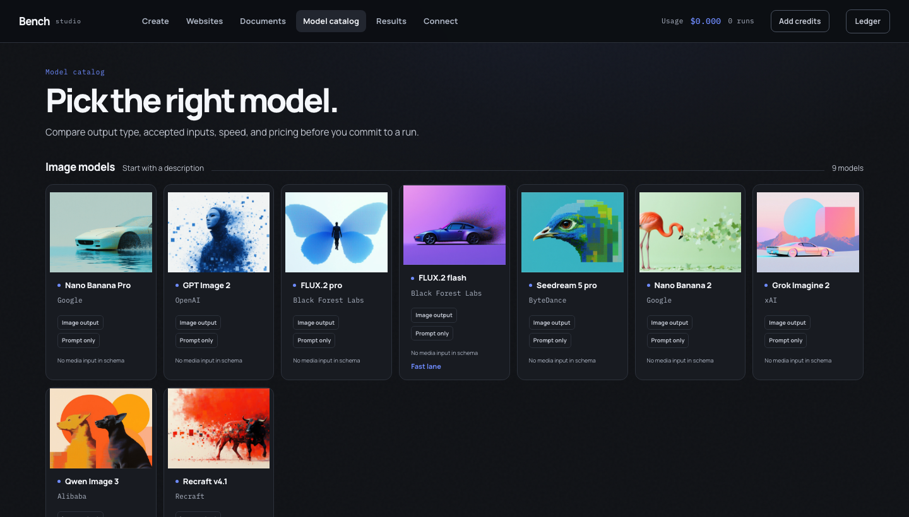
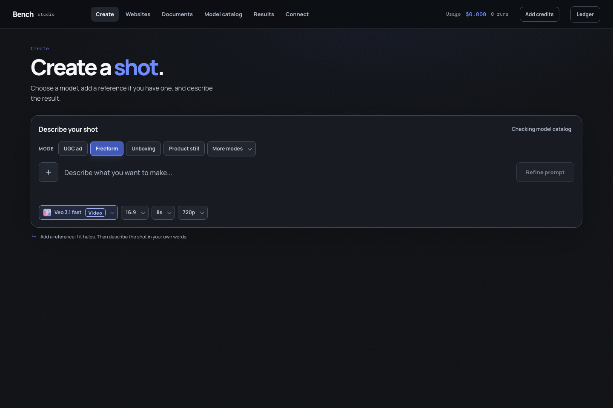
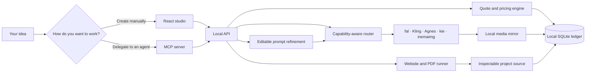
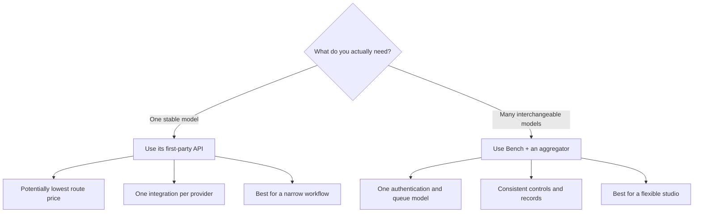
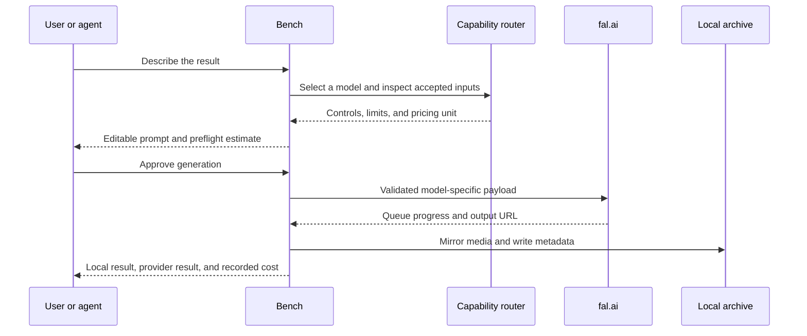
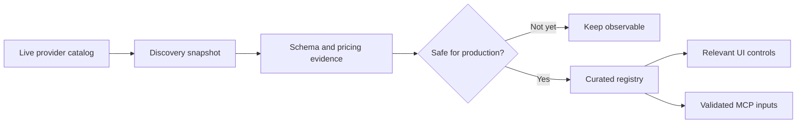
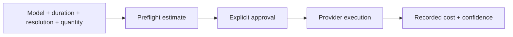
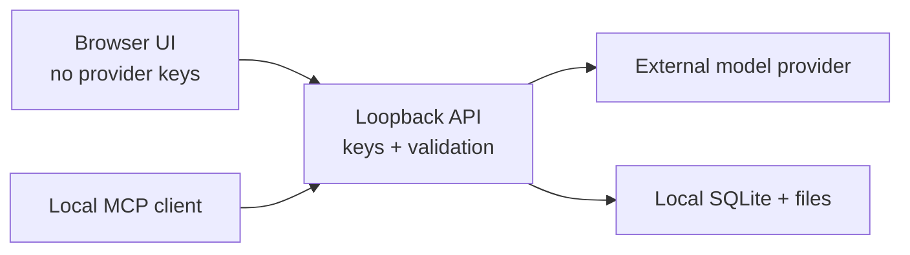

<div align="center">

# Bench Studio

### Stop renting the wrapper. Own the creative layer.

A local-first creative studio for images, videos, websites, designed PDFs, and AI-agent workflows.

[](LICENSE)


**[Quick start](#run-it-in-three-minutes)** · **[Tips](#tips-that-save-you-time-and-money)** · **[How it works in depth](docs/COMO-FUNCIONA.md)** · **[What changed and why](docs/HISTORICO.md)** · **[Security](#security-and-privacy)**

</div>



Bench Studio puts **73 curated image and video routes across 5 providers**, prompt refinement,
capability-aware controls, local file custody, and a transparent cost ledger
behind one interface. The same system is available to Claude, Codex, Cursor,
and other compatible clients through MCP.

Your keys stay server-side on your machine. Your prompts are editable before
you spend. Your outputs are mirrored locally. Your costs are recorded in real
units instead of disappearing into mystery credits.

> [!NOTE]
> This is the sanitized public distribution. It ships with no generation
> history, uploads, private database, personal paths, credentials, or local
> build artifacts. Your archive begins empty.

## 📖 Guia de uso

Guia completo (landing + passo a passo): **https://inematds.github.io/bench-studio-en/guia/**

## Why this exists

Most creative AI products combine five useful pieces—model access, prompt
polish, routing, storage, and billing—then hide the seams behind a monthly plan.
Bench keeps the convenience while making every seam inspectable.

| Instead of… | Bench gives you… |
| --- | --- |
| One provider's model roadmap | A curated registry you can add to or replace |
| A generic upload box | Controls derived from each endpoint's accepted inputs |
| An invisible prompt rewrite | An editable model-specific draft before submission |
| Abstract credits | A preflight estimate and recorded spend metadata |
| Outputs trapped in an account gallery | Local mirrored files and durable metadata |
| A UI-only workflow | The same capabilities through the UI and MCP |
| Waiting for the next feature | Source you can inspect, change, and extend |

Bench does **not** own the underlying models. It gives you ownership of the
portable layer that connects your ideas, tools, providers, files, and costs.

## Run it in three minutes

### What you need

**Required**

- Node.js **22.5+**; Node 24 recommended, because Bench uses `node:sqlite`.
- npm.

**That is the whole list.** Every provider is optional and degrades on its own:
a missing key makes those models show as unavailable, with the reason and how to
fix it — the studio still starts. Bring at least one of these to generate
anything:

| Provider | Models | Cost | What you need |
|---|---|---|---|
| [fal.ai](https://fal.ai/dashboard/keys) | 37 | dollars, live pricing | `FAL_KEY` |
| [Kling](https://klingai.com) | 26 | plan credits | `npm i -g @klingai/cli-global && kling login` |
| [Agnes AI](https://apihub.agnes-ai.com) | 4 | zero | `AGNES_API_KEY` |
| [kie.ai](https://kie.ai/api-key) | 4 | credits | `KIE_API_KEY` |
| [inemaimg](https://github.com/inematds/inemaimg) | 2 | zero (your GPU) | a running local server |

**Optional, but worth it**

- A [Google AI Studio](https://aistudio.google.com/apikey) or
  [OpenRouter](https://openrouter.ai/keys) key for prompt refinement. Without
  any refiner your prompt is sent raw — which Agnes rejects, because it requires
  English.
- Google Chrome, for PDF printing and visual preflight.
- A signed-in Codex or Claude Code, for agent-driven website and document builds.

### 1. Clone and install

```bash
git clone https://github.com/inematds/bench-studio-en.git
cd bench-studio-en
npm install
```

### 2. Add server-side credentials

```bash
cp .env.example .env
```

Fill in whatever you have. `.env.example` documents all 19 variables — what each
one unlocks, how it bills, and where to create the key. Keys stay server-side and
are never sent to the browser; `.env` is gitignored and written with owner-only
permissions.

Reading order, highest first:

```
exported in your shell  >  .env in the project  >  ~/.env
```

**Or skip the file entirely:** start the studio and use the **Config** button in
the top right. It shows every setting — present or missing, where the value came
from, and the last 4 characters — lets you test each provider, and writes `.env`
for you. For safety it only accepts writes from the machine running the studio.

### 3. Start the studio

```bash
npm run dev
```

Open **[http://localhost:5200](http://localhost:5200)**.

| Service | Address |
| --- | --- |
| Studio | `http://localhost:5200` |
| Local API | `http://localhost:8787` |
| Health and capability summary | `http://localhost:8787/api/health` |

If either port is occupied:

```bash
PORT=8790 BENCH_API_PORT=8790 BENCH_WEB_PORT=5201 npm run dev
```

## Reaching it from another machine

Both ports bind to loopback, so a fresh install answers nobody but you. Opening
that up means three things — the interface listening on every interface, a
firewall rule, and remembering to undo both. One command does all three:

```bash
./scripts/remote.sh open      # publish the interface on this machine's IP
./scripts/remote.sh status    # open or closed, and with what protection
./scripts/remote.sh close     # back to local access only
```

`open` prints the address to hand out, then tells you to restart with
`npm run dev`. `close` reverses exactly what `open` did — reading a state file
written at open time, not guessing — and leaves the SSH rule alone, because
deleting that is how people lock themselves out of their own server.

Two flags worth knowing:

```bash
./scripts/remote.sh open --ip 203.0.113.7   # only that address, not the internet
./scripts/remote.sh open --firewall         # also enable ufw (SSH allowed first)
```

**You will be let in without a password, and that is the default.** The studio
ships with no password because talking to your own machine should not need one —
`open` says so on screen rather than blocking you. Once you are in from the other
machine, set one and restart:

```bash
npm run set-password
```

What `open` deliberately does **not** do: publish the API. Port 8787 stays on
loopback (`BENCH_API_HOST`), so the endpoint that writes files and spends money
is reachable only through the interface, on the machine itself.

This is a test posture, not a deployment. The traffic is plain HTTP and readable
in transit. For anything that stays up, read the next section.

## Leaving it up safely

In rough order of what actually protects you:

1. **Set a password.** `npm run set-password`. Without it, the port is the only
   thing between the internet and your generated files.
2. **Keep the API on loopback.** The default. `BENCH_API_HOST=0.0.0.0` is an
   opt-out you should have a reason for.
3. **Narrow who can reach it.** `./scripts/remote.sh open --ip <your-ip>` beats
   an open port. A Tailscale address beats both, and needs no port at all.
4. **Turn the firewall on.** `./scripts/remote.sh open --firewall` allows SSH
   first, then enables ufw. Also check your VPS provider's own firewall panel —
   it sits in front of ufw and answers to nobody on the machine.
5. **Terminate HTTPS in front.** Point a domain at the machine and put nginx or
   Caddy in front with a Let's Encrypt certificate, proxying `/api`, `/media`,
   `/previews`, `/inputs` and `/projects` to `127.0.0.1:8787` and serving
   `npm run build`'s `dist/` as the site. Then close 5200 entirely. If you do
   this, make the proxy send `X-Forwarded-For`: the machine-only rule below
   depends on it.
6. **Run it as its own user, not root,** under a systemd unit, with `.env` at
   `600` — which is how the studio writes it.
7. **Close it when the test ends.** `./scripts/remote.sh close`. An exposure you
   forgot about is the one that costs you provider credits.

## Tips that save you time and money

**Start with the free routes.** Agnes (4 models) and inemaimg (2, on your own
GPU) cost nothing. In the Model catalog, the **No cost** switch turns exactly
that group on. Use them to find the prompt that works, then spend on the model
that renders it best.

**Curate the catalog once.** 73 models is a lot to scroll. Filter by provider,
then use "Disable those N" to hide what you will not use. Curation is a
preference, not a block: it hides models from the pickers but a **Redo** of an
old result still works. Deleting `data/catalog-prefs.json` restores the factory
state.

**Refine before you spend.** The refined prompt is editable before submission.
Read it. It is the cheapest place to catch a misunderstanding — after you submit,
the fix costs another run.

**Keep two refiners configured.** The chain is Gemini → OpenRouter → local Codex.
With a single one, an exhausted quota takes the whole studio down: the prompt
goes through raw, and Agnes rejects non-English with an error that looks like an
Agnes problem but is not.

**Redo instead of retyping.** Every result carries the model, controls, refined
prompt, original idea and attachments. Redo restores all of it, so you can tweak
one thing without paying for a rewrite.

**The same model can exist on two routes.** Veo, Nano Banana, gpt-image and
gemini-image appear via more than one provider — with different bills (dollars on
fal, plan credits on Kling). The provider is shown next to the name in the
picker; it is a real choice, not a duplicate.

**Kling never auto-retries, on purpose.** Every Kling job is charged, including
failures. Nothing is resubmitted behind your back.

**Watch disk, not CPU.** Every file is mirrored locally because provider URLs
expire — 24h on Kling, temporary on Agnes. Roughly 1.3 MB per image and 0.7–5 MB
per video. The studio idles at 274 MB of RAM.

**Building a website? Prefer an agent.** Codex and Claude Code write the files
themselves and fix their own mistakes. The model engines (local Qwen, OpenRouter)
only return text, so they need no sandbox and cost nothing — but they need more
supervision.

**Point the builder at a reference you own.** Set a site or PDF of yours in
Config and the builder calibrates its finish against it — tokens, fonts, palette,
radii. It never copies brand, copy, structure or files.

## What you can make

| Workspace | What it delivers |
| --- | --- |
| **Create** | Images and videos with model-aware references, controls, editable prompt drafts, quotes, progress, and inline results. |
| **Model catalog** | Curated text-to-image, image-editing, text-to-video, image-to-video, and reference-video routes. |
| **Results** | A local archive containing the submitted prompt, model, provider URL, local file, and recorded cost. |
| **Websites** | Original static sites with editable source, a local preview, and a downloadable bundle. |
| **Documents** | Designed PDFs backed by editable HTML, Chromium printing, and overflow preflight. |
| **Connect** | Machine-correct MCP configuration and a portable skill for compatible agents. |



## The system in 30 seconds



The browser never receives provider secrets. It talks to a local service that
validates model-specific payloads, owns credentials, streams progress, mirrors
artifacts, and records durable metadata.

## Choose the right connection strategy

Bench uses an aggregator because one authentication and queue model is the
practical way to support a large, interchangeable catalog. That is not the
only valid architecture.



An aggregator may not always be the cheapest route. Bench makes that tradeoff
explicit instead of calling it “zero markup.”

## One request, from idea to receipt



Bench records what was submitted. It never claims an attached reference
influenced an output merely because an API accepted the field; creative
fidelity still requires human review.

## Model intelligence, not a dropdown full of URLs

Every endpoint has different assumptions. Some accept one image, some accept a
list, some require a start frame, and others accept no references. Bench keeps
discovery separate from production admission:



This prevents a newly published, renamed, or underspecified model from silently
breaking a paid workflow.

## Prompt refinement stays visible

1. Write a normal creative request.
2. Bench adds the structure the selected model is likely to understand.
3. Review the rewritten prompt as an editable draft.
4. Change or reject it before spending anything.
5. Store the final submitted prompt with the result.

If no Google key is configured, the original prompt passes through unchanged
and the interface reports that refinement is disabled.

## Cost transparency without marketing math

Before submission, Bench estimates cost from the model's pricing unit and the
requested parameters. After completion, it records the billed amount when the
provider exposes sufficient receipt data.



Pricing changes. Estimates are not guarantees. Bench distinguishes estimated,
metered, and recorded values instead of presenting all three as the same fact.

## Your local data boundary

The repository starts with no `data/` directory. Bench creates it on first run:

```text
data/
├── bench.db              # generations, assets, spend, and projects
├── inputs/               # mirrored uploads
├── outputs/              # mirrored generations
├── previews/             # local video posters
└── projects/             # website and document source files
```

The entire directory is ignored by Git. Deleting a result removes its local
database record and mirrored files. It does not claim to delete copies retained
by an external model provider.



## Use it from Claude, Codex, or Cursor

Start Bench, open **Connect**, choose your client, and copy the generated
configuration. Bench inserts the correct absolute path for the current machine;
the repository itself ships with no user's home directory.

The MCP server exposes eleven focused tools for:

- discovering models and inspecting capability contracts;
- uploading local reference media;
- generating images and videos;
- reading results, previews, and spend;
- creating and polling website or document projects;
- retrieving local project artifacts.

The bundled skill in `integrations/skills/bench-studio/` provides judgment and
workflow guidance. MCP provides the live execution layer.

## Project map

```text
bench-studio-public/
├── src/                     # React interface
├── server/
│   ├── server.mjs           # loopback API and orchestration
│   ├── mcp.mjs              # stdio MCP server
│   ├── registry.json        # curated production roster
│   ├── capabilities.json    # accepted-input contracts
│   ├── profiles/            # prompt and pricing intelligence
│   └── mcp-app/             # embedded MCP interface
├── integrations/
│   ├── skills/bench-studio/ # portable agent workflow skill
│   └── macos/               # optional launch-agent templates
├── tests/                   # contracts, persistence, API, a11y, and E2E
├── docs/                    # public README media
├── .env.example             # placeholders only
└── package.json
```

## Documentation

| Document | What it covers |
|---|---|
| [`docs/COMO-FUNCIONA.md`](docs/COMO-FUNCIONA.md) | How the system works inside: the provider contract, the traps measured per provider, cost classes, availability vs curation, the refine chain, the builder, and the security model |
| [`docs/HISTORICO.md`](docs/HISTORICO.md) | Everything built on top of the original kit, and every bug found — separating the ones that were already there from the ones introduced along the way |
| [`CHANGELOG.md`](CHANGELOG.md) | Version by version |
| [`.env.example`](.env.example) | All 19 settings, what each unlocks, and where to get the key |
| [`SECURITY.md`](SECURITY.md) | Threat model and reporting |

## Useful commands

| Command | Purpose |
| --- | --- |
| `npm run dev` | Start the local API and web interface. |
| `npm run build` | Build the production web application. |
| `npm run registry` | Rebuild the curated model registry. |
| `npm run capabilities` | Rebuild the capability manifest. |
| `npm run catalog:sync` | Refresh provider discovery and pricing evidence. |
| `npm run mcp` | Start the stdio MCP server. |
| `npm run set-password` | Set or change the studio password (`-- --remove` clears it). |
| `./scripts/remote.sh open` | Publish the interface on this machine's IP, firewall rule included. |
| `./scripts/remote.sh close` | Undo it — back to local access only. |
| `./scripts/remote.sh status` | Open or closed, on which port, with or without a password. |
| `npm run test:contracts` | Run API, persistence, and model-contract tests. |
| `npm run test:mcp` | Smoke-test MCP discovery and media behavior. |
| `npm run test:e2e` | Run browser journeys and accessibility checks (needs `npx playwright install chromium` once). |
| `npm run test:release` | Run the complete release gate. |

## Security and privacy

**Default posture.** Both ports bind to loopback and there is **no password** —
talking to your own machine should not require one. Nothing leaves your machine
except the calls you make to the providers you configured.

**Keys.** Read server-side, never returned to the UI. The Config screen shows
presence, origin and the last 4 characters — never the value. `.env` is written
with owner-only permissions (`600`) and is gitignored.

**Optional password.** Set `BENCH_PASSWORD` and the API requires a session:

```bash
npm run set-password              # asks for it, without echoing
npm run set-password -- --remove
```

Stored as a scrypt hash, so nobody reads your password out of the file. Setting
or changing it signs everyone else out immediately. Forgot it? Delete the line
from `.env` and restart — that is the recovery path, on purpose, because whoever
has that file already has the keys inside it.

The password protects the API and your generated files. The interface shell is
still served to anyone who reaches the port, but without a session it shows
nothing. Hiding the shell too is a reverse proxy's job, not this process's.

**Writing settings is machine-only.** Even with a valid session, `POST` to the
config endpoints is refused from the network — changing keys requires being at
the machine. This survives the dev proxy: the API only trusts a forwarded origin
when the socket is already loopback, so a request from the network cannot forge
one.

**Exposing it.** `./scripts/remote.sh open` publishes the interface and opens the
port; `close` undoes both. See [Reaching it from another
machine](#reaching-it-from-another-machine) and [Leaving it up
safely](#leaving-it-up-safely). Prefer Tailscale or a password-protected reverse
proxy over an open port.

- Generated media may still be retained by an external provider according to
  that provider's terms.
- Website and document creation can invoke a locally authenticated coding
  agent. Review generated source before deploying it.

Read [SECURITY.md](SECURITY.md) before exposing, modifying, or redistributing
the service.

## Honest boundaries

- Bench is a local, single-user tool—not a hosted multi-tenant SaaS product.
- The registry is curated intentionally; catalog presence does not guarantee
  production admission.
- Accepted inputs do not guarantee creative fidelity.
- Website output is static by design.
- PDF creation depends on a local Chrome installation.
- Model availability and pricing can change after a catalog sync.
- Owning the layer means maintaining a small piece of software.

## Release confidence

The release gate covers production builds, API and database contracts, MCP
discovery, browser journeys, accessibility, responsive containment, failure
states, model transitions, and visual snapshots.

```bash
npm run test:release
```

## License

Bench Studio Public is available under the [MIT License](LICENSE).

---

<div align="center">

**The models do the heavy lifting. Bench makes the layer around them visible—and yours.**

</div>
